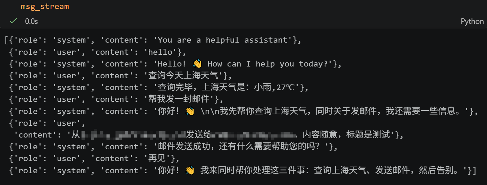

# function_call_example
基于VS CODE 的 openAI的API接口+Deepseek模型的function call用例

**可参考**

1. deepseek API: https://api-docs.deepseek.com/zh-cn/

2. openAI API: https://developers.openai.com/api/reference/python/resources/chat/subresources/completions/methods/create

**运行**

1. 修改 config.json中配置
2. 运行main即可

**说明**
1. 采用直接调用工具，调用结果加入对话流的方式，当轮AI不输出。--> 会影响模型在后续的回复
2. 建议在工具调用后，将结果让AI整合（比如.responses.create）后再加入对话流，可能改善
3. 注意：调用工具轮，role也保持system，采用tool则模型无法生成新的回答
