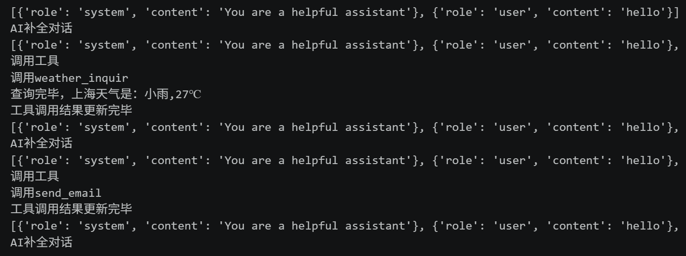

# function_call_example
基于VS CODE 的 openAI的API接口+Deepseek模型的function call用例

**可参考**

deepseek API: https://api-docs.deepseek.com/zh-cn/
openAI API: https://developers.openai.com/api/reference/python/resources/chat/subresources/completions/methods/create

**运行**

1. 修改 config.json中配置
2. 运行main即可
